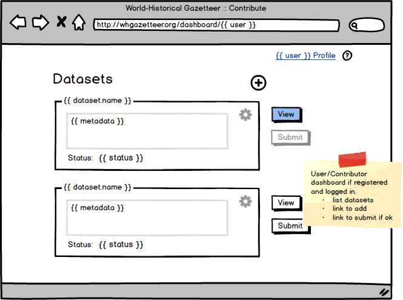
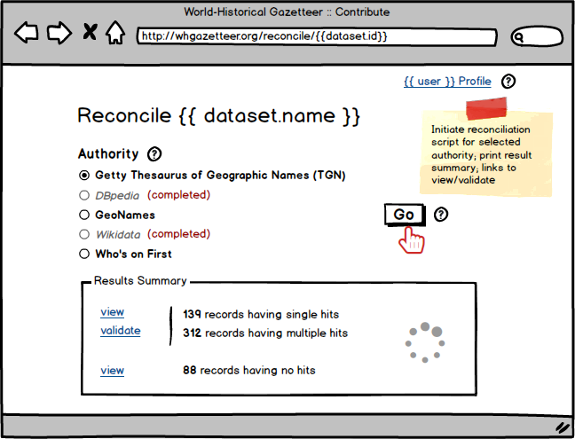

## WHGazetteer Contributions app wireframes

*Draft for comment, 9 Oct 2018*

We are building three interfaces to World-Historical Gazetteer data, and work is well under way (initial Alpha release, early 2019):

- **Contributions** (reconciliation, validation)
- **Application Programming Interface** (API)
- **Graphical search and browse** (GUI)

One primary goal of the project is to make contributing data a relatively simple process, requiring a minimum of intervention by WHG project staff. The following are proposed steps for contributing:

- **Register as a user with contributing privileges**
- **View/edit datasets in user dashboard**
- **Upload (add) place data in [Linked Places format](https://github.com/LinkedPasts/linked-places) or CSV**. Data will be validated as complying with those formats, errors reported. In near future annotation data will be accepted.)
- **Submit dataset for reconciliation with one or more authority**. Submitted data should have links (matches) to one or more authority sources. These might already be included, but if absent...
- **Validate hits returned by reconciliation step**...contributors can add them by running our reconciliation scripts, then validating hits returned. Current plans include Getty TGN, DBpedia, GeoNames, and Wikidata. 
- **When dataset status is ok, submit as contribution**
- **Cursory check of submission by WHG**
- **Dataset added to WHG database and 'registry index'**

Easy, no?! ;^)

The following screens indicate what we have in mind to build. They are schematic, indicating required functionality and not appearance. Comments as issues in this repo (preferred), or by [email](mailto:grossner@pitt.edu) or twitter (@WHGazetteer) are welcome. Work on this is commencing now, so sooner the better.

### not registered/logged in
</a>

### dashboard
</a>

### add/upload dataset
</a>

### view/edit dataset
</a>

### initiate reconciliation
</a>

### view reconciliation hits
</a>

### validate hits
</a>
